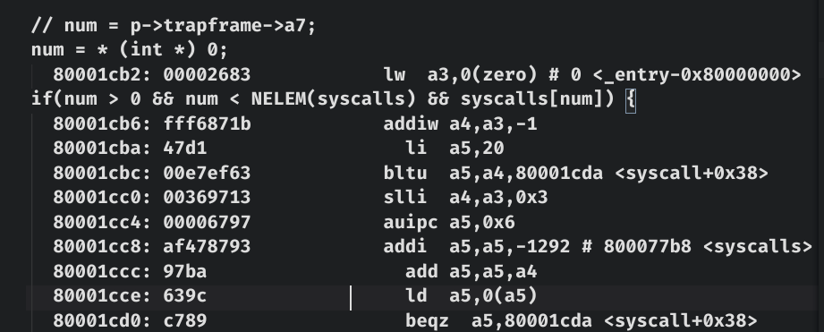
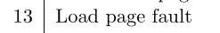
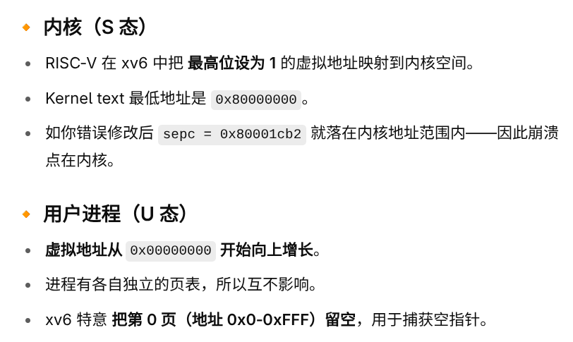

replace num = p->trapframe->a7 with:  
```
num = *(int*)0
```

    xv6 kernel is booting

    hart 1 starting
    hart 2 starting
    scause=0xd sepc=0x80001cb2 stval=0x0
    panic: kerneltrap

find sepc value in kernel.asm: 


So num corresponds to register a3

Accually a7 corresponds to syscall number. ( 'exec' in this case : init when booting )

scause = 0xd means load page fault.
 

spec=0x80001cb2 is in kernel.


address 0 is not mapped in the kernel address space.
